# How It Works — Spotify Review Discovery Engine

A complete walkthrough of what this project does, how it's built, how data flows from
the Google Play Store all the way to the live dashboard, and how to run, refresh, and
deploy it.

> **TL;DR** — It pulls recent Spotify Play Store reviews, embeds them into a vector
> database, uses an LLM (Groq) to surface themes / segments / unmet needs, and serves
> everything through a Streamlit dashboard with a grounded RAG chatbot. A weekly GitHub
> Actions job keeps the data current.

---

## 1. The big picture

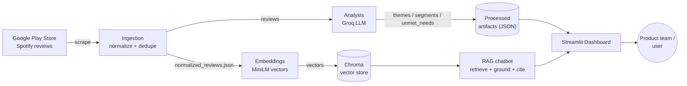

**Two data products are generated:**

1. **Batch insights** (themes, user segments, unmet needs) — precomputed JSON artifacts.
2. **Interactive RAG chat** — answers free-form questions, grounded only in retrieved
   review text, with `review_id` citations.

---

## 2. Architecture at a glance

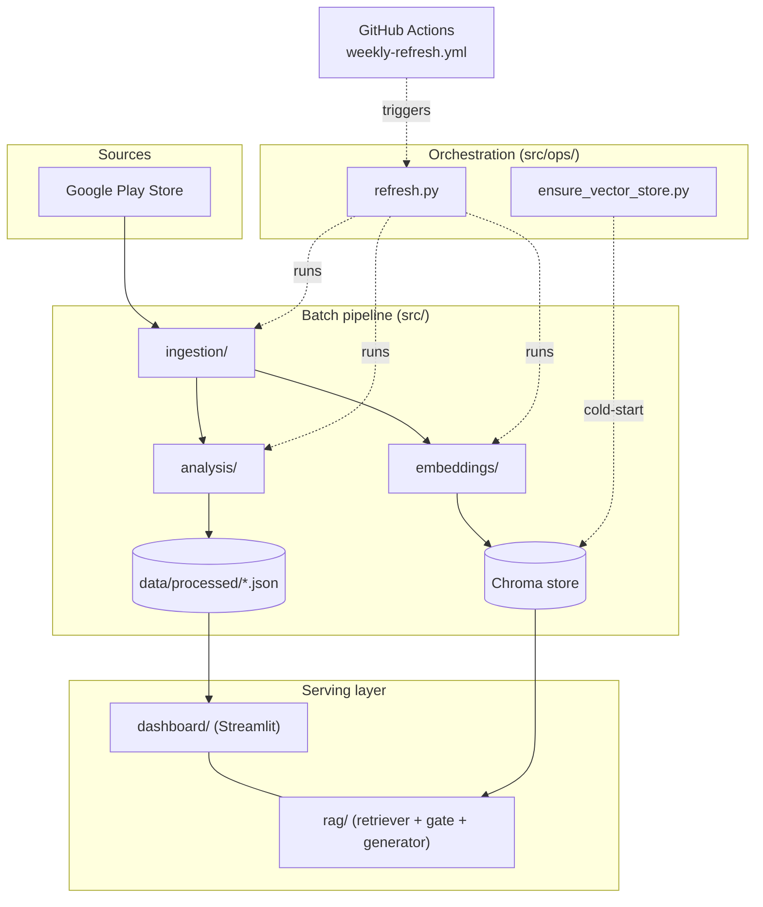

### Tech stack

| Layer | Technology |
|---|---|
| Language | Python 3.12 |
| Scraping | `google-play-scraper` |
| Embeddings | `sentence-transformers` (MiniLM, local) — Groq embeddings optional |
| Vector DB | `chromadb` (persistent, cosine distance) |
| LLM | Groq (`llama-3.3-70b-versatile`) |
| UI | `streamlit` (custom Spotify-style design system) |
| Automation | GitHub Actions |

---

## 3. Repository layout

```
NL Ai Review Engine/
├── src/
│   ├── config.py                 # Non-secret defaults (paths, K values, thresholds)
│   ├── ingestion/                # Phase 1 — fetch + normalize reviews
│   │   ├── fetch.py              #   scrape Google Play (rolling lookback window)
│   │   ├── normalize.py          #   clean, dedupe, language + length filters
│   │   ├── schema.py             #   NormalizedReview dataclass
│   │   └── run.py                #   CLI entrypoint
│   ├── embeddings/               # Phase 2 — vectorize + store
│   │   ├── local_embedder.py     #   sentence-transformers MiniLM
│   │   ├── groq_embedder.py      #   optional Groq embedding backend
│   │   ├── store.py              #   Chroma wrapper (upsert, query, hashing)
│   │   └── run.py                #   CLI: incremental embed-all / query
│   ├── analysis/                 # Phase 3 — LLM insights
│   │   ├── sampler.py            #   pick representative reviews
│   │   ├── groq_client.py        #   Groq chat wrapper
│   │   ├── pipeline.py           #   themes / segments / unmet needs
│   │   ├── rule_baseline.py      #   keyword fallback when Groq unavailable
│   │   ├── validators.py         #   provenance + PII validation
│   │   └── run.py                #   CLI entrypoint
│   ├── rag/                      # Phase 5 — grounded chatbot
│   │   ├── retriever.py          #   Chroma search + MMR re-ranking
│   │   ├── gate.py               #   out-of-scope + similarity threshold
│   │   ├── generator.py          #   Groq answer with citations
│   │   ├── fallback_answer.py    #   retrieval-only answer if Groq unavailable
│   │   └── pipeline.py           #   answer_question() orchestration
│   ├── dashboard/                # Phase 4 — Streamlit UI
│   │   ├── app.py                #   entrypoint + tabs
│   │   ├── bootstrap.py          #   load .env + map platform secrets
│   │   ├── style.py              #   design system + answer formatter
│   │   ├── data_loader.py        #   load + validate artifacts (LKG fallback)
│   │   ├── pipeline_status.py    #   freshness / online status
│   │   ├── pipeline_refresh.py   #   trigger GitHub refresh from the UI
│   │   └── components/           #   header, overview, themes, segments, …
│   └── ops/                      # Phase 6 — orchestration
│       ├── refresh.py            #   ingest -> embed -> analyze
│       └── ensure_vector_store.py#   build/update Chroma on cold start
├── data/processed/               # Committed artifacts (the "database of record")
│   ├── normalized_reviews.json   #   the corpus (rebuilds Chroma on deploy)
│   ├── themes.json / segments.json / unmet_needs.json
│   ├── run_metadata.json
│   └── lkg/                      #   last-known-good snapshot
├── vector_store/                 # Prebuilt Chroma index (COMMITTED for fast deploys)
├── scripts/smoke_test.py         # Deployment readiness checks
├── .github/workflows/weekly-refresh.yml
└── requirements.txt
```

---

## 4. How it's built — phase by phase

### Phase 1 — Ingestion (`src/ingestion/`)

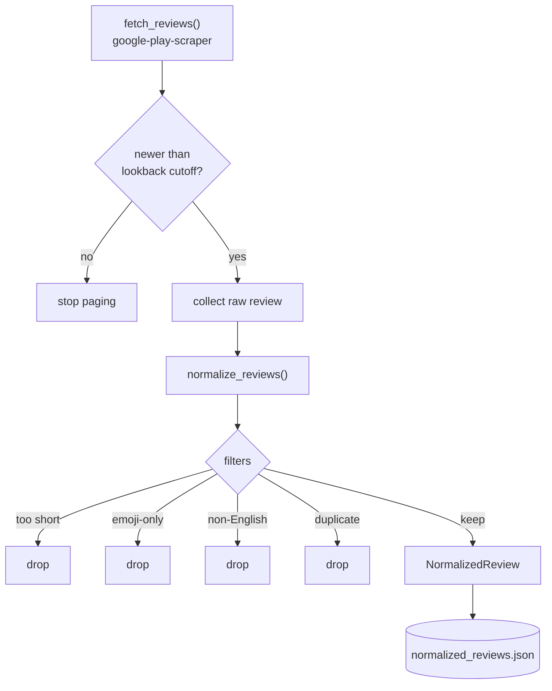

- Fetches newest reviews for `com.spotify.music`, paging until it crosses the
  **lookback cutoff** (`LOOKBACK_WEEKS`, default 10). This is a **rolling window** — each
  run rewrites `normalized_reviews.json` with reviews current up to today.
- Normalization removes PII risk and noise: minimum word count, language detection,
  emoji-only and duplicate removal.
- Output fields are non-PII only: `review_id`, `rating`, `date`, `app_version`,
  `thumbs_up`, `title`, `body`.

Run it:

```bash
python -m src.ingestion.run --lookback-weeks 10
```

### Phase 2 — Embeddings + vector store (`src/embeddings/`)

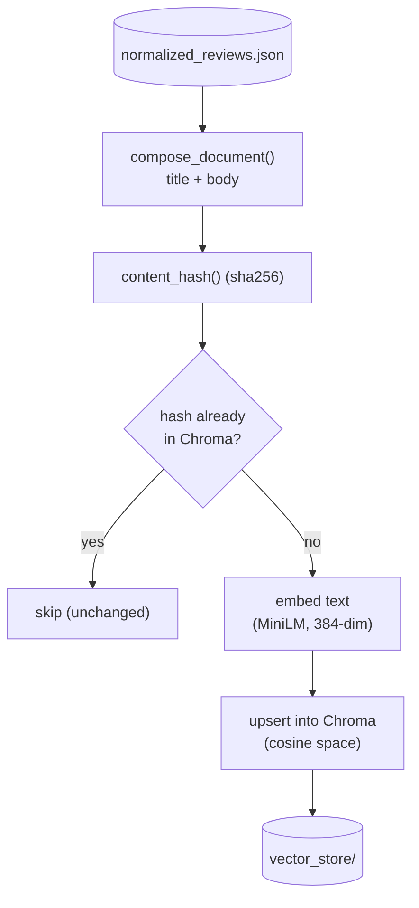

- **One review = one vector** (no chunking — reviews are short).
- **Incremental by content hash**: only new/changed reviews are embedded, so re-runs are
  cheap.
- Default backend is **local MiniLM** (`EMBEDDING_BACKEND=local`); a Groq embedding
  backend is available but optional.
- Cosine distance is converted to a `[0,1]` similarity score for the UI.

Run it:

```bash
python -m src.embeddings.run                       # embed all pending
python -m src.embeddings.run --query "shuffle"     # retrieval sanity check
```

### Phase 3 — Analysis (`src/analysis/`)

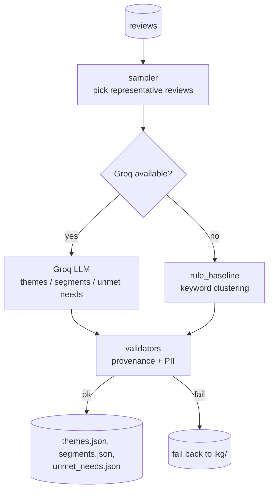

- Produces three artifacts: **themes** (≤5), **user segments**, **unmet needs**.
- Every generated claim must reference real `review_id`s in the corpus —
  `validators.py` enforces this and blocks PII.
- If Groq is unavailable (quota/network), `rule_baseline.py` produces keyword-based
  results so the pipeline never hard-stops.

Run it:

```bash
python -m src.analysis.run                 # Groq-powered
python -m src.analysis.run --rule-baseline # keyword fallback
```

### Phase 5 — RAG chatbot (`src/rag/`)

This is the interactive Q&A. See the detailed flow in [§5](#5-the-rag-chatbot-in-detail).

---

## 5. The RAG chatbot in detail

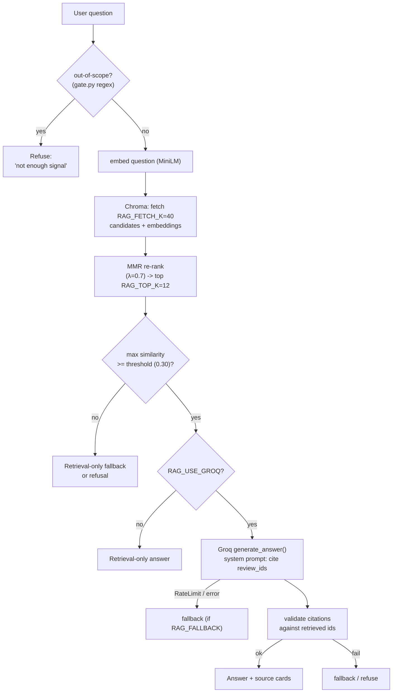

### Retrieval with MMR (Maximal Marginal Relevance)

Plain nearest-neighbour search tends to return several near-duplicate reviews (and can be
dominated by keyword-matching praise even for "why do users struggle" questions). MMR
fixes this:

1. Pull a **candidate pool** of `RAG_FETCH_K` (default **40**) most-similar reviews.
2. Iteratively select `RAG_TOP_K` (default **12**) that balance **relevance to the query**
   against **diversity from already-selected results**, controlled by `RAG_MMR_LAMBDA`
   (default **0.7**; 1.0 = pure relevance, 0.0 = pure diversity).
3. If embeddings are unavailable for any reason, it safely falls back to plain similarity
   order.

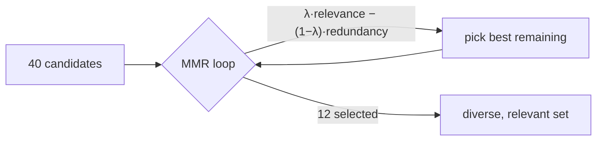

### Grounding + safety gates

- **Out-of-scope filter** (`gate.py`): regex blocks questions about stock price, CEO,
  roadmap, competitors → returns a refusal instead of guessing.
- **Similarity threshold** (`RAG_SIMILARITY_THRESHOLD`): if the best match is too weak,
  it won't call the LLM.
- **Citation validation**: the answer's `[review_id: …]` citations are checked against the
  actually-retrieved ids; a failed check triggers fallback.
- **Graceful fallback** (`fallback_answer.py`): if Groq is rate-limited/unavailable and
  `RAG_FALLBACK=true`, it returns a retrieval-only summary instead of an error.

### How the answer is shown

`dashboard/style.py :: format_chat_answer()` renders the insight text large and bold, and
converts inline `[review_id: …]` citations into compact, de-emphasised id pills. A
**"Source reviews"** expander lists every retrieved review (up to `RAG_TOP_K`).

---

## 6. The dashboard (`src/dashboard/`)

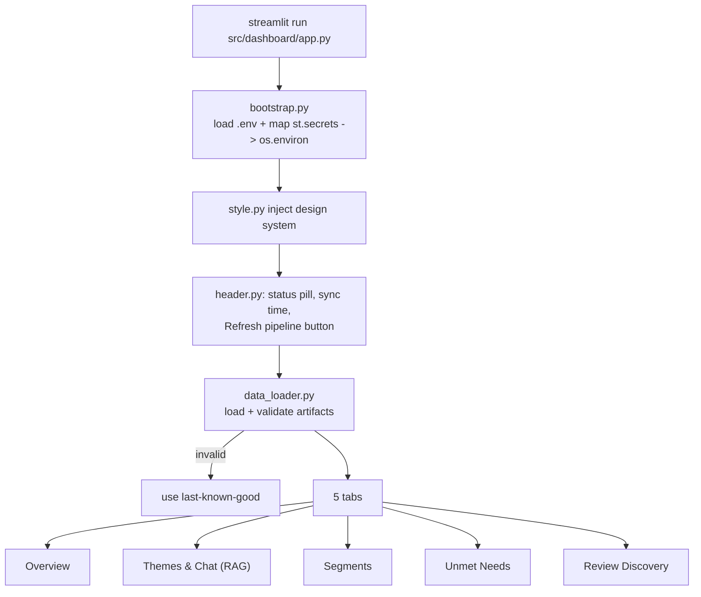

- **Bootstrap** loads `.env` locally and maps platform secrets (Streamlit Cloud / HF
  Spaces) into `os.environ`, flattening nested TOML sections so a misplaced key still
  works.
- **Data loader** validates artifacts on every load; if the current run is invalid it
  transparently falls back to the **last-known-good** (`lkg/`) snapshot so the dashboard
  never shows broken data.
- **Tabs**: Overview (metrics + trends), Themes & Chat (theme cards + the RAG chatbot),
  Segments, Unmet Needs, and Review Discovery (search/browse).

---

## 7. Keeping data fresh — the refresh mechanism

There are **two ways** the data gets refreshed, both running the same pipeline.

### A) Scheduled / manual GitHub Actions job

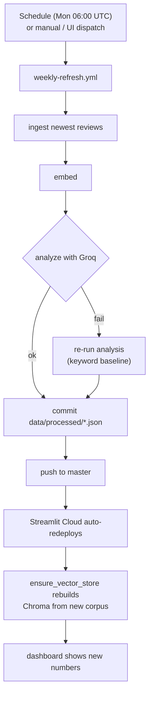

**Why the deploy is fast:** the prebuilt `vector_store/` (Chroma index) is **committed**
to the repo. On deploy the app loads it instantly — no full re-embedding. Because the
weekly job updates `normalized_reviews.json` but not the committed index,
`ensure_vector_store` only embeds the **small weekly delta** (the newly ingested reviews)
on the next cold start, which takes seconds rather than minutes.

The workflow prefers Groq analysis but falls back to the keyword baseline so themes stay
consistent with the freshly ingested corpus and the commit always lands.

### B) In-app "Refresh pipeline" button

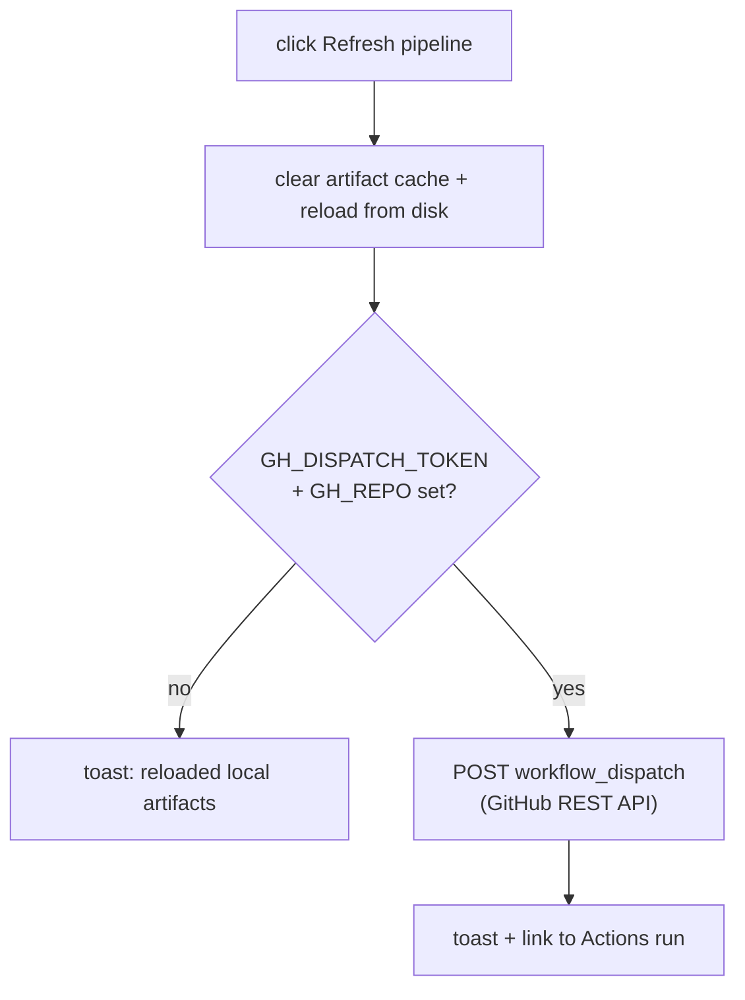

When `GH_DISPATCH_TOKEN` + `GH_REPO` are configured, the button triggers the GitHub
workflow above; otherwise it just reloads local artifacts. (Built with the standard
library only — no extra dependency.)

### Incremental embedding on a warm store

`ensure_vector_store` is smart about warm stores:

| Store state | Action |
|---|---|
| Empty | Full build from corpus |
| Warm, new/changed reviews | Embed **just** the new ones (cheap hash check, no model load) |
| Warm, nothing new | Ready instantly |

---

## 8. Configuration reference

Non-secret defaults live in `src/config.py`; everything is overridable via environment
variables (`.env` locally, platform Secrets in deployment).

| Variable | Default | Meaning |
|---|---|---|
| `GROQ_API_KEY` | — (secret) | Groq API key (chat + optional embeddings) |
| `HF_TOKEN` | — (secret) | Hugging Face token (quiet local-embedding downloads) |
| `EMBEDDING_BACKEND` | `local` | `local` (MiniLM) or `groq` |
| `LOCAL_EMBEDDING_MODEL` | `all-MiniLM-L6-v2` | sentence-transformers model |
| `GROQ_CHAT_MODEL` | `llama-3.3-70b-versatile` | Groq chat model |
| `LOOKBACK_WEEKS` | `10` | Rolling ingestion window |
| `RAG_USE_GROQ` | `true` | Use Groq for chat answers |
| `RAG_FALLBACK` | `true` | Retrieval-only answer when Groq unavailable |
| `RAG_TOP_K` | `12` | Reviews sent to the LLM (kept ≤13 for context budget) |
| `RAG_FETCH_K` | `40` | Candidate pool before MMR |
| `RAG_MMR_LAMBDA` | `0.7` | MMR relevance/diversity trade-off |
| `RAG_SIMILARITY_THRESHOLD` | `0.30` | Min similarity to call the LLM |
| `RAG_MAX_ANSWER_TOKENS` | `768` | Max answer length |
| `GH_DISPATCH_TOKEN` | — (optional) | PAT (`actions:write`) for the refresh button |
| `GH_REPO` | — (optional) | `owner/repo` for workflow dispatch |

---

## 9. Run it locally

```bash
# 1. Create + activate a virtualenv, then install deps
python -m venv .venv
.venv\Scripts\activate            # Windows
pip install -r requirements.txt

# 2. Configure secrets
copy .env.example .env            # then paste your GROQ_API_KEY

# 3. (First time) build data + vector store
python -m src.ingestion.run --lookback-weeks 10
python -m src.embeddings.run
python -m src.analysis.run        # or --rule-baseline

# 4. Launch the dashboard
streamlit run src/dashboard/app.py

# 5. Sanity check anytime
python scripts/smoke_test.py
```

The smoke test verifies artifacts exist, the data loader works, the vector store is
populated, and the chatbot both retrieves and refuses out-of-scope questions.

---

## 10. Deploy it

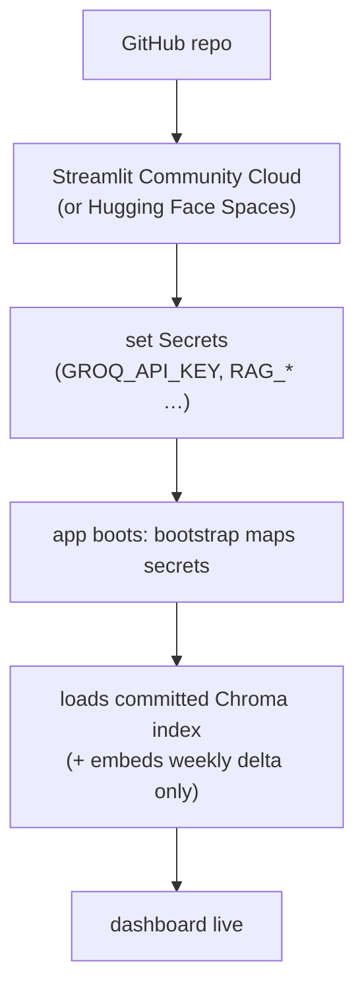

1. Push to GitHub.
2. Create the app on Streamlit Community Cloud pointing at `src/dashboard/app.py`.
3. Add **Secrets** (TOML) — at minimum `GROQ_API_KEY`, plus the `RAG_*` tuning values.
4. Reboot the app after editing secrets so they reload.
5. (Optional) add `GROQ_API_KEY` to the repo's **Actions secrets** to power the weekly
   refresh, and `GH_DISPATCH_TOKEN` + `GH_REPO` to power the in-app refresh button.

> The deploy disk is **ephemeral**, so the prebuilt `vector_store/` is committed to the
> repo and ships with each deploy — the app loads it instantly instead of re-embedding
> 27k+ reviews on a weak free-tier instance (which would otherwise hang on
> "Checking search index…"). Only the small weekly delta is embedded on cold start.

---

## 11. Troubleshooting

| Symptom | Cause | Fix |
|---|---|---|
| `Retrieval-only fallback · GROQ_API_KEY not found` | Key not in Secrets, or app not rebooted | Add `GROQ_API_KEY` to Secrets (top-level TOML, quoted), then **Reboot app** |
| Chat cites only 4 reviews | `RAG_TOP_K` overridden to a low value in Secrets | Set `RAG_TOP_K = "12"` in Secrets and reboot |
| Dashboard shows "last-known-good" warning | Latest analysis failed validation | Re-run analysis; check `run_metadata.json` |
| Refresh button only reloads locally | `GH_DISPATCH_TOKEN` / `GH_REPO` not set | Add them to Secrets (see §7B) |
| Chat feels slow | Large candidate pool | Lower `RAG_FETCH_K` to `30` |
| Weekly job didn't update data | `GROQ_API_KEY` missing in Actions secrets, or no new reviews | Add the secret; check the Actions run logs |

---

## 12. Design principles

- **Grounded, never hallucinated** — the chatbot answers only from retrieved review text
  and cites `review_id`s; out-of-scope questions are refused.
- **Fails soft, never hard** — keyword baseline for analysis, retrieval-only fallback for
  chat, and last-known-good artifacts for the dashboard.
- **Corpus is the source of truth** — vectors are derived and disposable; the committed
  reviews file rebuilds everything.
- **Privacy-first** — only non-PII fields are stored, and validators block PII in
  generated output.
```
